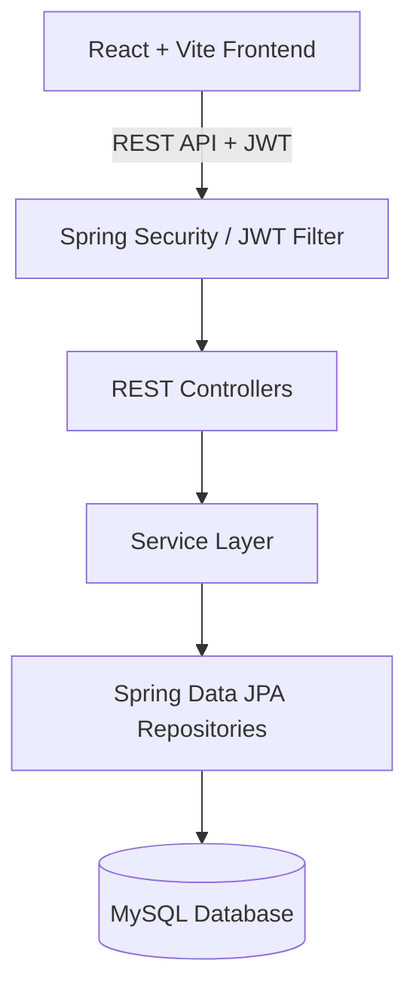
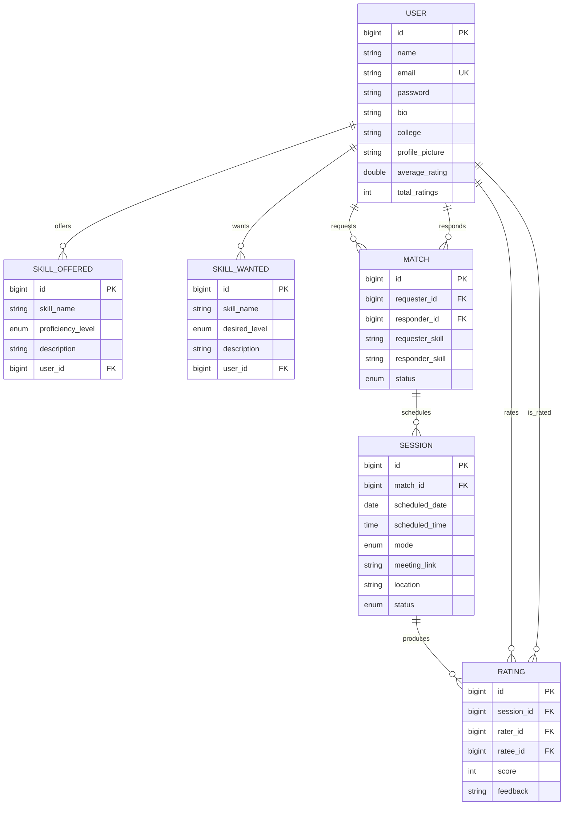

# SkillMatch – Peer-to-Peer Skill Exchange Platform

SkillMatch is a full-stack web application designed for college students to exchange skills on a barter basis without monetary transactions.

---

## 🏗️ Architecture Overview



### Entity Relationship Diagram



---

## 📁 Folder Structure

```
SkillMatch/
├── skillmatch-backend/
│   ├── src/main/java/com/skillmatch/
│   │   ├── config/          # SecurityConfig, WebConfig, DataSeeder
│   │   ├── controller/      # Auth, User, Skill, Match, Session, Rating, Health
│   │   ├── dto/             # Request & Response DTOs
│   │   ├── entity/          # JPA Entities
│   │   ├── enums/           # MatchStatus, SessionStatus, SessionMode, ProficiencyLevel
│   │   ├── exception/       # GlobalExceptionHandler
│   │   ├── repository/      # Spring Data Repositories
│   │   ├── security/        # JwtUtil, JwtAuthenticationFilter, CustomUserDetailsService
│   │   └── service/         # Business Logic Services
│   └── src/main/resources/  # application.properties, application-prod.properties
└── skillmatch-frontend/
    ├── src/
    │   ├── api/             # Axios instance & interceptors
    │   ├── components/      # Navbar, ProtectedRoute
    │   ├── context/         # AuthContext
    │   ├── pages/           # Home, Login, Register, Dashboard, Profile, Matches, Sessions, Search, Settings, UserProfile
    │   └── App.jsx          # React Router configuration
    └── vercel.json          # Deployment config
```

---

## ⚡ API Summary

| Category | Method | Endpoint | Access | Description |
|----------|--------|----------|--------|-------------|
| **System** | `GET` | `/api/health` | Public | System health check |
| **Auth** | `POST` | `/api/auth/register` | Public | Register new user |
| | `POST` | `/api/auth/login` | Public | Authenticate user & issue JWT |
| **Users** | `GET` | `/api/users/me` | Authenticated | Get current user profile |
| | `PUT` | `/api/users/me` | Authenticated | Update current profile |
| | `POST` | `/api/users/me/profile-picture` | Authenticated | Upload avatar image |
| | `GET` | `/api/users/search?query=` | Public | Search users |
| | `GET` | `/api/users/{id}` | Public | View public user profile |
| **Skills** | `POST` | `/api/skills/offered` | Authenticated | Add offered skill |
| | `DELETE`| `/api/skills/offered/{id}` | Authenticated | Remove offered skill |
| | `POST` | `/api/skills/wanted` | Authenticated | Add wanted skill |
| | `DELETE`| `/api/skills/wanted/{id}` | Authenticated | Remove wanted skill |
| | `GET` | `/api/skills/search?query=` | Public | Search skills |
| **Matches** | `GET` | `/api/matches/suggestions` | Authenticated | Run matching algorithm |
| | `POST` | `/api/matches/{id}/accept` | Authenticated | Accept match |
| | `POST` | `/api/matches/{id}/reject` | Authenticated | Reject match |
| **Sessions** | `POST` | `/api/sessions` | Authenticated | Schedule session |
| | `GET` | `/api/sessions` | Authenticated | List user sessions |
| | `PUT` | `/api/sessions/{id}/status` | Authenticated | Update session status |
| **Ratings**| `POST` | `/api/ratings` | Authenticated | Rate completed session |
| | `GET` | `/api/ratings/user/{id}`| Public | Get user ratings |

---

## 📸 Screenshots

*(Place screenshots here)*
- Dashboard Overview
- Skill Matching & Suggestions
- Session Scheduling
- Public User Profile & Reviews

---

## 🚀 Local Setup Instructions

### Prerequisites
- Java 21 JDK
- Maven 3.8+
- Node.js 18+
- MySQL Server

### 1. Database Setup
```sql
CREATE DATABASE skillmatch_db;
```

### 2. Backend Setup
```bash
cd skillmatch-backend
mvn spring-boot:run
```
Backend starts on `http://localhost:8080`.

### 3. Frontend Setup
```bash
cd skillmatch-frontend
npm install
npm run dev
```
Frontend starts on `http://localhost:5173`.

---

## 🌐 Production Deployment

### Backend (Render)
1. Create a **Web Service** on Render connected to `skillmatch-backend`.
2. Build command: `mvn clean package -DskipTests`
3. Start command: `java -jar target/skillmatch-backend-1.0.0.jar --spring.profiles.active=prod`
4. Set environment variables (`MYSQL_URL`, `DB_USER`, `DB_PASSWORD`, `JWT_SECRET`, `ALLOWED_ORIGINS`).

### Database (Railway MySQL)
1. Provision a **MySQL Instance** on Railway.
2. Copy connection URL to `MYSQL_URL` on Render.

### Frontend (Vercel)
1. Import `skillmatch-frontend` repository in Vercel.
2. Set Environment Variable: `VITE_API_BASE_URL=https://your-backend-service.onrender.com/api`
3. Deploy.

---

## 📄 License
This project is licensed under the [MIT License](LICENSE).
